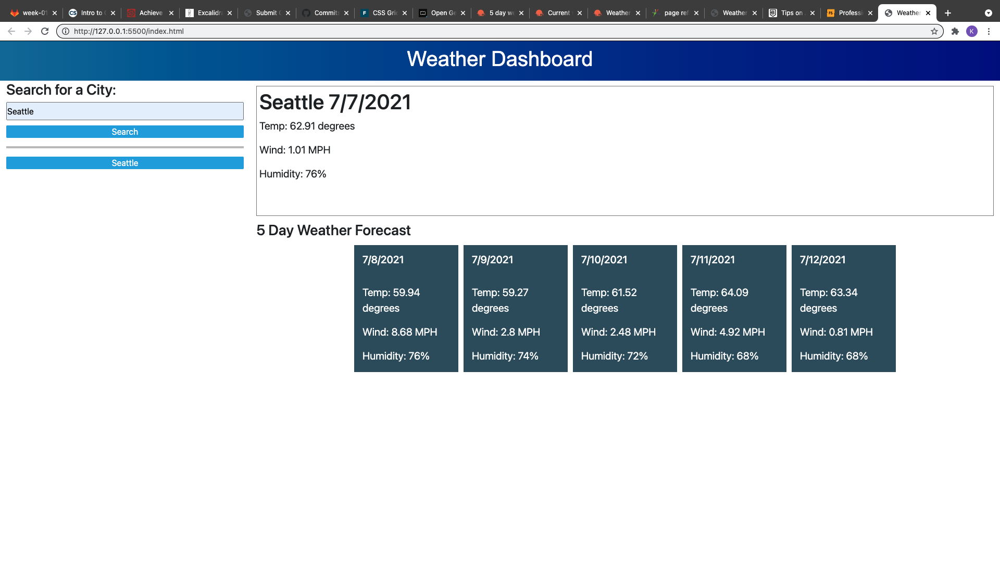

# weather-dashboard

Thie weather dashboard was created in order to supply users with accurate weather data when searching by city.
It would display the weather for that day and as well as for the next 5 days.

This project was executed to test my knowledge in using third party APIs as well as to demonstrate knowledge of momentjs, bootstrap and local storage.

Below is a screenshot of my dashboard

My deployed application:
[Weather Dashboard](https://ksapir.github.io/weather-dashboard/)